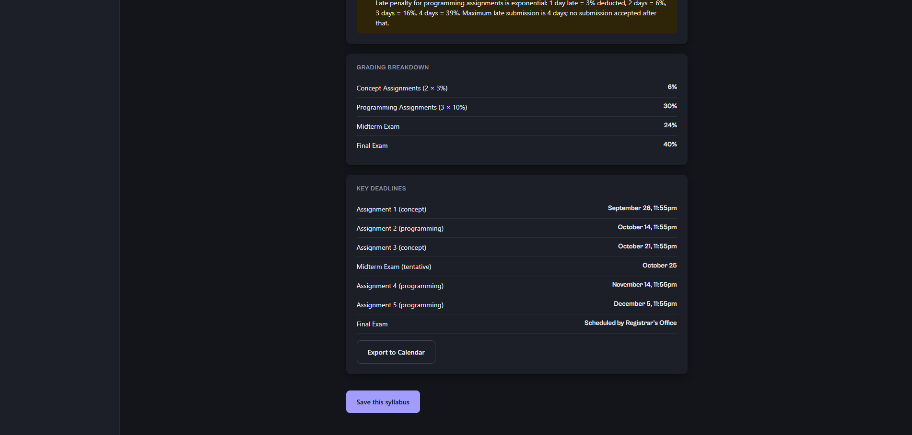
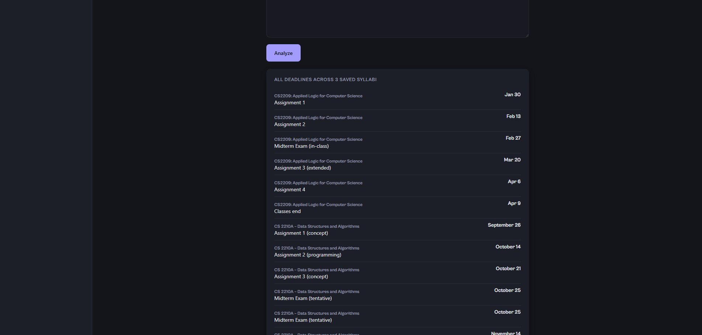
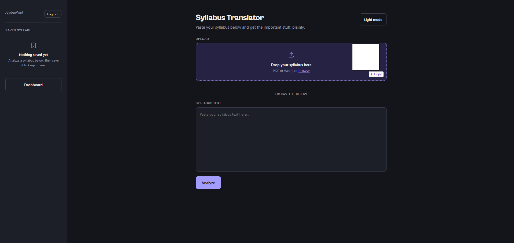
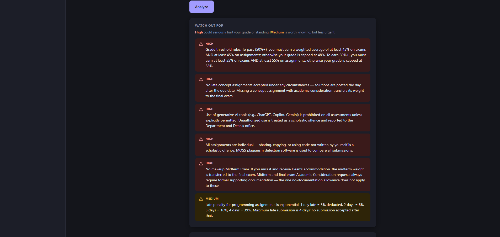
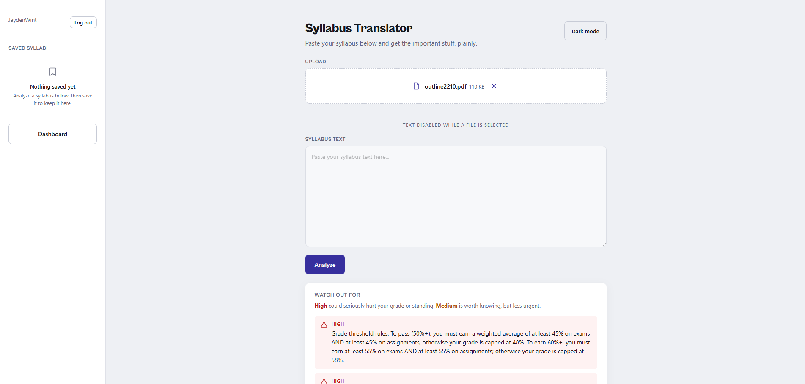

# Marginalia

**Live demo:** [syllabus-translator-env.eba-fcadaxyt.us-east-2.elasticbeanstalk.com](http://syllabus-translator-env.eba-fcadaxyt.us-east-2.elasticbeanstalk.com/)

A full-stack tool that extracts the important stuff from a course syllabus — grading breakdown, deadlines, and easy-to-miss policies that could hurt your grade — and presents it clearly instead of making you dig through pages of dense text.

## Why I built this

Syllabi bury critical information (grade-threshold rules, harsh late penalties, no-makeup policies) in dense paragraphs students often skim past. This tool uses Claude to extract and prioritize what actually matters, so nothing important gets missed.

## Features

- **Paste text or drag-and-drop a file** — supports pasted text, PDF, and DOCX syllabi, with a real drag-and-drop upload zone and staged status feedback ("Reading file...", "Analyzing with Claude...")
- **AI-powered extraction** — structured breakdown of grading weights, deadlines, and severity-ranked policy flags, with a plain-language legend explaining what "high" vs "medium" severity actually means
- **Calendar export** — download deadlines as a `.ics` file (importable into Google Calendar, Apple Calendar, or Outlook), available from both a single syllabus and the combined multi-course dashboard, with course names auto-included to disambiguate identically-named deadlines
- **User accounts** — sign up, log in, and keep saved syllabi private to your account, with per-user data isolation enforced at the database level
- **Save & revisit** — save analyzed syllabi, rename them inline, and pull them back up anytime; each saved item shows a severity indicator and deadline count at a glance
- **Undo-able delete** — deleting shows a 5-second "Undo" toast instead of destroying data instantly
- **Multi-syllabus dashboard** — every deadline across all saved classes, combined and chronologically sorted, with its own calendar export
- **Dark mode** — theme preference saved across visits, with a full custom typography and color system (self-hosted Cabinet Grotesk, tokenized color system) that stays consistent in both themes
- **Motion throughout** — modals, toasts, deletions, theme switches, and screen transitions all animate intentionally rather than snapping, with full `prefers-reduced-motion` support
- **Accessible by design** — keyboard-operable throughout (real focus management, focus trapping in modals, ARIA live regions on error states), semantic landmarks, and WCAG AA contrast compliance
- **Responsive design** — works on mobile as well as desktop

## How it works

1. Paste syllabus text or drag/upload a PDF or DOCX file
2. The backend extracts raw text (if a file was uploaded) and sends it to Claude with a structured extraction prompt
3. Claude returns categorized JSON: grading breakdown, deadlines, and prioritized, severity-ranked flags
4. The frontend renders it as clean, scannable cards
5. Save it to your account, export deadlines to your calendar, or view all your saved syllabi together on the dashboard

## Tech stack

- **Backend:** Python, Flask
- **Database:** SQLite
- **AI:** Anthropic Claude API
- **Auth:** Flask sessions with hashed passwords (Werkzeug)
- **File parsing:** pypdf, python-docx
- **Frontend:** HTML/CSS/JavaScript (vanilla, no framework), self-hosted variable-weight typography

## Running locally

1. Clone the repo and create a virtual environment
2. `pip install -r requirements.txt`
3. Create a `.env` file with:
   ```
   ANTHROPIC_API_KEY=your_key_here
   FLASK_SECRET_KEY=any_long_random_string
   ```
4. `python app.py`
5. Open `http://127.0.0.1:5000`

## Development notes

This project was built iteratively with heavy use of AI-assisted design critique tooling (a custom accessibility/UX audit skill) to identify and fix real issues across several passes — including WCAG contrast failures, missing keyboard support, and a data-correctness bug (duplicate saves on rapid double-click). The commit history reflects that iterative process: feature work, followed by critique-driven hardening passes.

## What I'd improve next

- Password recovery flow (currently no way to reset a forgotten password — a known gap)
- Rewrite raw backend error messages into clearer, user-facing copy
- Prevent duplicate course names when saving
- A more distinctly "academic" visual identity, rather than generic SaaS-tool styling
- Deploy for live public use (containerized with Docker, targeting AWS/GCP)
- Search/filter for saved syllabi once a user has many saved

## Screenshots







